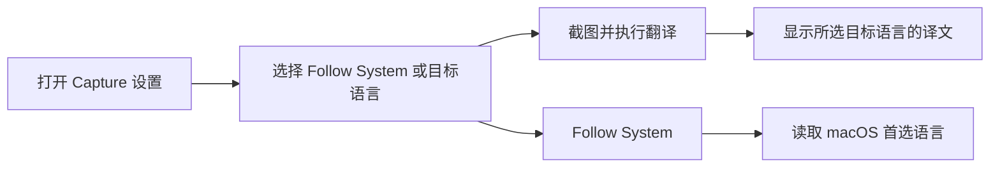
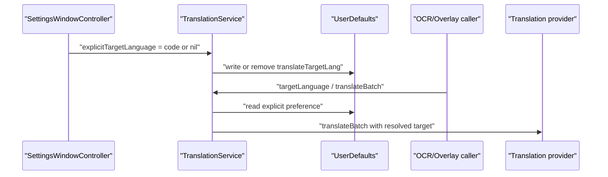

# Engineering Review — diff upstream/main...codex/translation-target-language-pr

## 0. 概览

| 项 | 值 |
|---|---|
| 评审对象 | diff-range |
| 目标 | `8ce1a37...77b244a` |
| 规模 | 49 files, +640/-9 |
| 可合并 / 接入状态 | 基点 `upstream/main` 是当前分支祖先；无冲突 |
| CI / 门禁 | 无仓库内 GitHub Actions 工作流；本地 Release/Debug 构建与独立语言解析测试通过 |
| 评审门 | **PASS** (0 P1) |

## 1. 变更性质

- ✏️ 翻译目标默认行为：没有显式偏好时，从固定语言改为解析第一项 macOS 首选语言。
- 🆕 设置能力：Capture 设置新增目标语言和 `Follow System` 选项。
- 🆕 语言解析单元：新增 `TranslationTargetLanguage`，隔离 locale 归一化和偏好读写。
- ✏️ 本地化：为 40 个 `Localizable.strings` 增加两条设置文案。

## 2. 产品 / 体验影响

| 功能 | 旧体验 | 新体验 | 回退风险 |
|---|---|---|---|
| 截图翻译目标语言 | 目标语言不能在设置中选择 | 默认跟随系统，用户可选择固定目标语言 | 系统语言不在列表中时回退英语 |

## 3. 功能详述

- `TranslationTargetLanguage` 将 `Locale.preferredLanguages.first` 归一化；中文脚本和地区映射为 `zh-CN` 或 `zh-TW`，不支持的语言回退 `en`。
- `translateTargetLang` 有效时是显式偏好；`Follow System` 删除该键，让后续读取继续跟随系统语言。
- `SettingsWindowController` 在每次 `loadSettings()` 刷新 popup，避免 OCR/覆盖层改变显式语言后出现陈旧选择。
- `OCRResultController` 和 `TranslationOverlay` 均调用 `TranslationService.translateBatch(texts:targetLang:)`，目标代码被转交给 Google 或 Apple Provider。

关键链路回归检查：未触达登录、网络鉴权、支付、异步队列或持久化数据库；翻译调用链的输入参数由既有 UI 传递，默认值变化是产品预期行为。

## 4. API / 路由

N/A — 未新增或修改 HTTP/API 路由。Google Translate 非官方 endpoint 和 Apple Translation 框架调用均保持既有接口。

## 5. 数据表 / 集合

N/A — 无数据库、集合、schema 或迁移变更。唯一持久化数据为现有 `UserDefaults` 键 `translateTargetLang`。

## 6. 链路图

## 7. 依赖的外部服务 / 第三方

- Google Translate endpoint：既有依赖，目标语言参数继续通过 `tl` 传递。
- Apple Translation：既有 macOS 15+ 框架依赖；仅在系统可用时显示 Engine 及语言包入口。
- 无新增 SDK、服务或凭证。

## 8. 新增依赖、库与内部模块/组件

- 新外部库：无。
- 新增内部模块：`macshot/Services/TranslationTargetLanguage.swift`，只依赖 Foundation。
- 新增 UI 控件：`SettingsWindowController` 的目标语言 popup。

## 9. 改动模块地图

| 模块 | 作用 |
|---|---|
| `macshot/Services` | 解析系统 locale、存储显式偏好、将目标语言供翻译服务读取 |
| `macshot/UI/Windows` | 设置页目标语言控件和刷新逻辑 |
| `macshot/UI/Overlay`、`AppDelegate` | 更新默认目标语言语义说明 |
| `macshot/*.lproj` | 设置文案本地化 |
| `Tests` | 独立语言解析与偏好读写测试 |

## 10. 架构合规

| 检查项 | 结果 |
|---|---|
| AppKit UI 在控制器中构建 | ✅ 沿用 `SettingsWindowController` 的现有模式 |
| 偏好持久化 | ✅ 复用既有 `UserDefaults` 键并集中校验 |
| 文件同步 Xcode 组 | ✅ 新 Swift 文件位于 `macshot/` 下，无需手改 project 文件 |
| macOS 12.3 兼容 | ✅ 目标语言 popup 不依赖 Apple Translation；Apple 专属 UI 保持可用性检查 |

## 11. 后端可靠性四维度

N/A — 这是单机 AppKit 应用中的本地偏好和翻译请求变更，不涉及服务副本、数据库状态机、消息队列或长任务调度。

## 12. 安全专项

- 偏好值只接受 `availableLanguages` 白名单中的代码；无效已有值被忽略且不在读取时改写。
- 无新密钥、用户身份、授权边界、命令执行或不可信输入解释逻辑。
- Google endpoint 仍为既有外部依赖；本次没有扩大其请求数据范围。

## 13. 前端性能 / 兼容性

- popup 构建遍历约 30 个语言项，仅在设置 UI 初始化时执行。
- `loadSettings()` 只对一个 popup 做线性项匹配，开销可忽略。
- macOS 12–14 可选目标语言并使用 Google Provider；macOS 15+ 保留 Apple Provider 与语言包入口。

## 14. 测试覆盖

- `Tests/TranslationTargetLanguageTests.swift` 覆盖 locale 分隔符、中文简繁映射、首选语言回退、显式偏好、清除偏好及无效旧值。
- `swiftc macshot/Services/TranslationTargetLanguage.swift Tests/TranslationTargetLanguageTests.swift -o /tmp/macshot-translation-target-tests && /tmp/macshot-translation-target-tests`：通过。
- Debug 和 Release `xcodebuild`：通过。
- 40 个 `Localizable.strings` 中两条新增 key 均存在且 `plutil -lint` 通过。
- 仍缺少 AppKit popup 交互的自动化 UI 测试，以及 provider 参数转交的端到端测试；当前由构建和调用链审阅覆盖。

## 15. 可观测性

N/A — 本次未新增异步服务、遥测事件或错误吞没路径；翻译 provider 的既有错误回调保持不变。

## 16. 冲突状态

无。`upstream/main` 是该分支的祖先，当前没有待解决合并冲突。

## 17. 问题清单

| # | 级别 | 位置 | 问题 | 本对象引入? | 建议修法 | 来源 |
|---|---|---|---|---|---|---|
| 1 | 提示 | `SettingsWindowController.swift` | 未提供自动化 AppKit popup 交互测试 | 是 | 后续如引入 UI test target，覆盖 macOS 12–14 与 15+ 可见性及 Follow System 切换 | Codex |
| 2 | 提示 | `TranslationService.swift` | 未提供 provider 参数转交的集成测试 | 是 | 后续可通过注入 provider transport 进行测试 | Codex |

## 18. 结论与建议

- Gate：**PASS**。
- P1/P2：无。
- 建议：可以合并；保留两项自动化测试作为后续质量改进，不阻塞本 PR。
